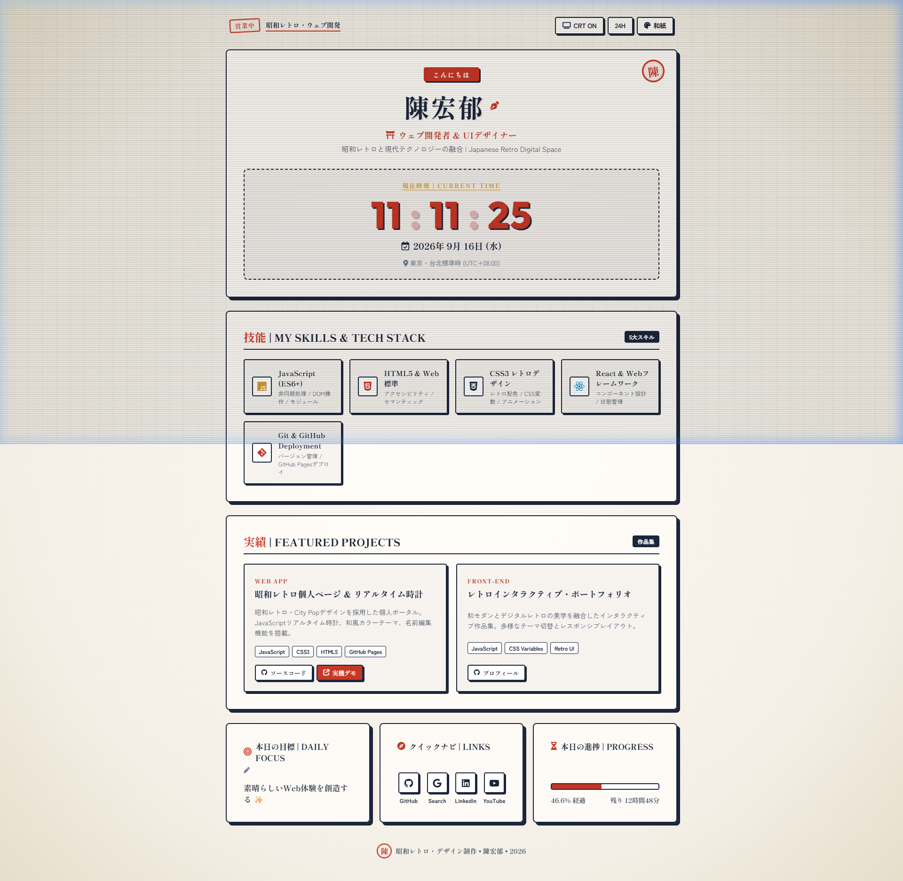

# 昭和レトロ・個人ポートフォリオ (Japanese Retro Dashboard) 🎌



A high-aesthetic Japanese Retro / Showa City Pop (昭和レトロ・City Pop) personal page & live real-time dashboard built with HTML5, CSS3, and JavaScript.

## 🚀 Features

- 🏮 **Japanese Retro & Hanko Stamp Aesthetic**: Traditional Japanese Hanko seal stamps (朱印 / 印鑑 "陳" and "営業中"), Mincho typography (`Shippori Mincho`), and vintage paper grid texture.
- 📺 **CRT Scanline Overlay**: Toggleable TV CRT scanlines effect for authentic retro visual texture.
- ⏰ **Live Japanese Real-Time Clock**: Ticking digital clock (`HH:MM:SS`), Japanese date notation (`2026年 9月 16日 (水)`), timezone offset, and 12H/24H format toggle.
- 🌅 **Time-Aware Japanese Greetings**: Dynamic Japanese greetings (`おはようございます`, `こんにちは`, `こんばんは`, `おやすみなさい`).
- ✏️ **Customizable Name & Goal**: Click to edit your name and daily focus goal with automatic `localStorage` saving.
- 🎨 **3 Showa Color Themes**:
  - 📜 **和紙 (Showa Paper)**: Ochre washi paper texture with vermilion red (`#c83726`) & deep indigo accents.
  - 🌃 **CityPop (80s City Pop)**: Midnight neon Synthwave aesthetic.
  - 🌙 **昭和夜 (Showa Dark)**: Vintage dark room aesthetic.
- 🛠️ **Skills & Projects Showcase**: 5 skill badges and featured project cards with direct GitHub & Live Pages deployment links.

## 📁 Project Structure

```
.
├── demo.png       # Japanese Retro showcase screenshot
├── index.html     # Japanese Retro HTML structure & Hanko stamps
├── styles.css     # Showa paper palette, CRT scanline overlay, typography
└── script.js      # Japanese date engine, real-time clock, CRT toggle, themes
```

## 🌐 Live Website

- **Live Site (GitHub Pages)**: [https://a9110118888.github.io/0916-personal-page/](https://a9110118888.github.io/0916-personal-page/)
- **GitHub Repository**: [https://github.com/a9110118888/0916-personal-page](https://github.com/a9110118888/0916-personal-page)

## 📜 License

MIT License
